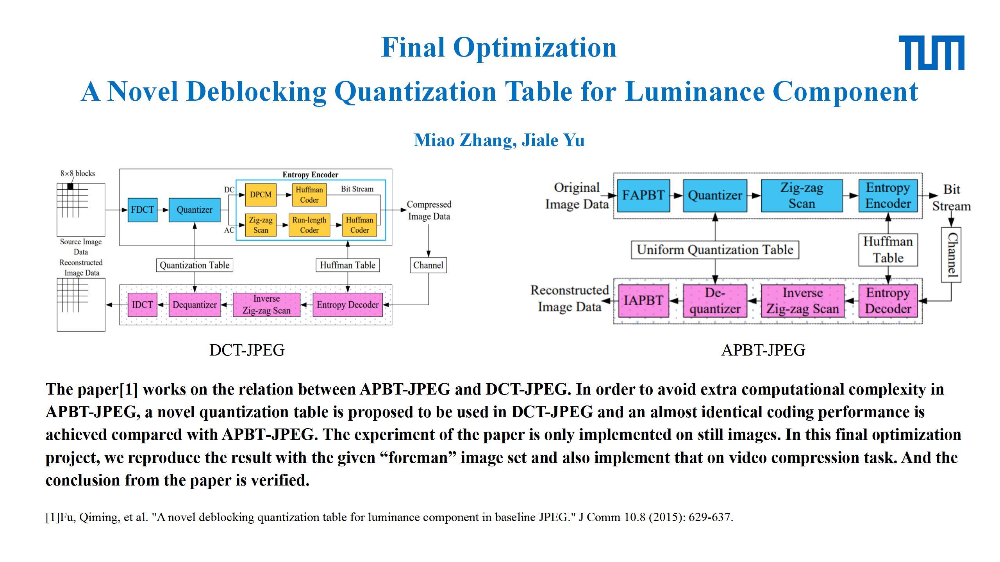
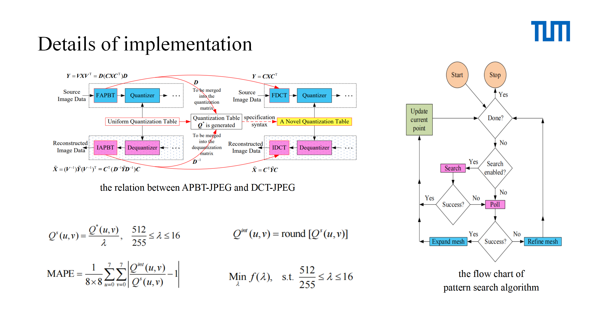
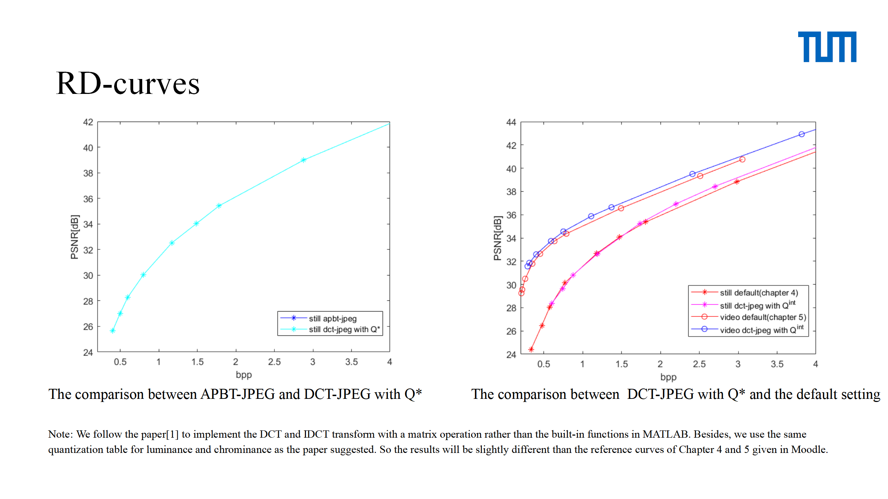

# A-Novel-Deblocking-Quantization-Table-for-Luminance-Component
## introduction
A final project for TUM master course: [EI50291] Image and Video Compression Lab

A matlab implementation of the paper: “A Novel Deblocking Quantization Table for Luminance Component in Baseline JPEG”[link](http://www.jocm.us/uploadfile/2015/0824/20150824112248702.pdf).

The paper works on the relation between APBT-JPEG and DCT-JPEG. In order to avoid extra computational complexity in APBT-JPEG, a novel quantization table is proposed to be used in DCT-JPEG and an almost identical coding performance is achieved compared with APBT-JPEG. The experiment of the paper is only implemented on still images. In this final optimization project, we reproduce the result with the given “foreman” image set and also implement that on video compression task. And the conclusion from the paper is verified.

## Requirement
MATLAB Global Optimization Toolbox
## Instruction:
1. Put the images folder 'foreman20_40_RGB' and image 'lena_small.tif' in the same path as the .m file.
2. make sure that MATLAB Global Optimization Toolbox has been installed successfully.
3. The project is aimed to reproduce the results of the paper, please run the code as the section comments.

## Figures



## Reference
Partly based on: <https://github.com/murong-xu/ivc_lab>

Please cite:
```
@article{fu2015novel,
  title={A Novel Deblocking Quantization Table for Luminance Component in Baseline JPEG.},
  author={Fu, Qiming and Jiang, Baochen and Wang, Cheng-You and Zhou, Xiao},
  journal={J. Commun.},
  volume={10},
  number={8},
  pages={629--637},
  year={2015}
}
```

